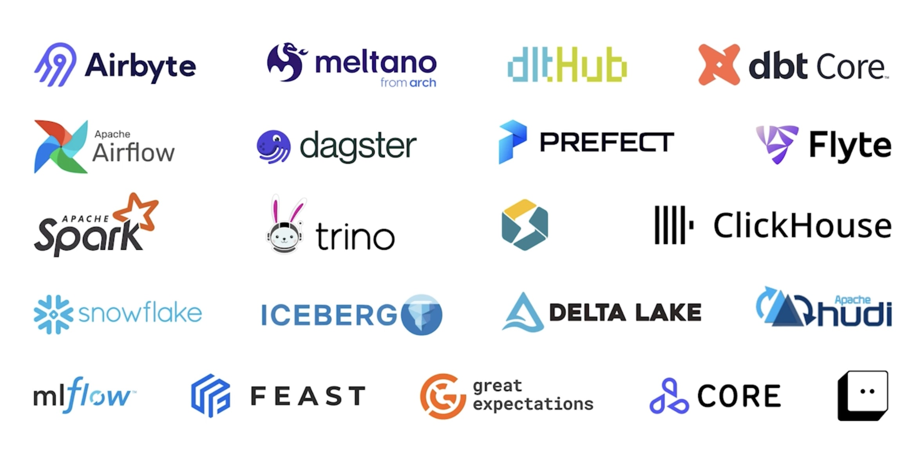
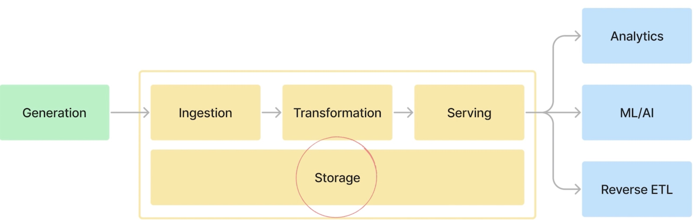
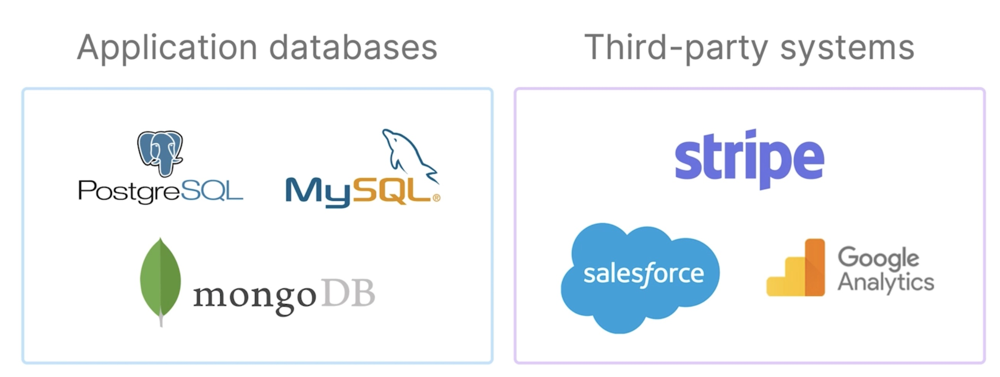

# data-engineer-101

- [data-engineer-101](https://www.udemy.com/course/data-engineering-101-the-beginners-guide/learn/lecture/43190218#overview)

- Intros
    - Data engineering covers many topics
        - ETL
        - Storage
        - Data modeling
        - Data pipeline architectures
        - and etc...
    - many tools
        - 

- Section 1: what is data engineering?
    - 

- Section 2: Data pipeline in-depth
    - Generation of data
        - 
    - Storage
        - Types of storage systems
            - e.g. File storage vs object storage
        - Row-based storage vs columnar storage
        - data warehouse vs data lakehouse
        - right type of storage can have a performance difference of up to 100x

    - Ingestion
        - Batch vs streaming ingestion
        - ETL vs ELT
        - different ways to ingest data from different source systems

    - Transformation
        - SQL queries
        - Data modeling
        - Normalization

    - Serving
        - Data analysts
        - Data scientists
        - Reverse ETL

- Section 3: Shared components that underlie our entire data pipeline
    - Shared components
        - DataOps
        - Orchestration
        - Security
        - Data quality
        - Data privacy

- Section 4: Actual exmaples of data architectures for different use cases
    - examples of data architectures
        - Business analytics use case
        - Streaming use case
        - ML use case
        - Deep Learning use case